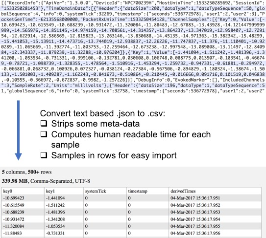
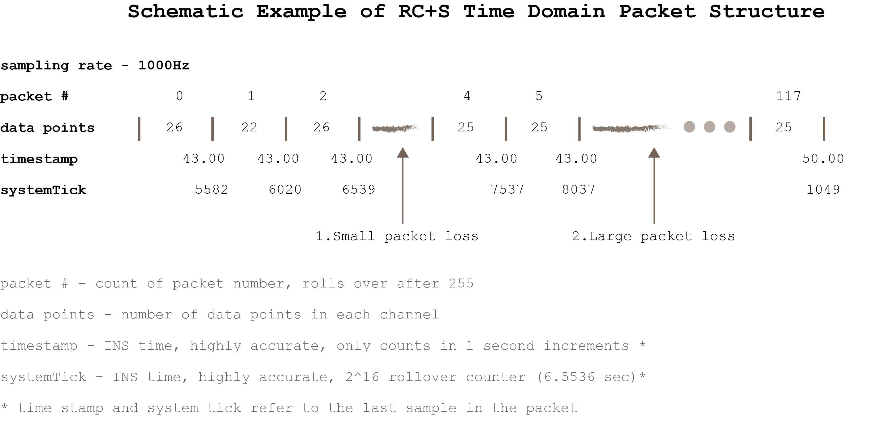

Deserialization of RC+S Time Domain and Accelerometry Data
==

Summary: 
-------------

The RC+S streams data in packet form. Because the streaming backend employs a UDP-like protocol (where there is no capacity for packet recovery), it becomes critical to account for packet loss during streaming and data post-processing. Failing to account for packet loss will adversely affect computation of PSDs and other event related measures.

For most data science applications, it is useful to format data in a "tidy" matrix in which each row represents an instance of a time domain measurement and each column represents the set of features associated with that particular measurement (i.e. the metadata). Our code performs the operation of efficiently transforming raw data from the RC+S (saved in the form a JSON file) into a CSV file (albeit at the expense of increased storage utilization).

Below is a visual summary of what raw saved data looks like (in JSON form) vs. the derived data from our code:



Implementation Overview: 
-------------

* `Matlab`
	* Parses RC+S time domain data (in the form of a `RawDataTD.json` file) into a CSV output with samples along rows and channels in columns.
	* Creation of a CSV file is optional thus allowing for in-memory manipulation of the data without the overhead time associated with data saving it to disk.

* `Python`
	* Parses both RC+S time domain and accelerometry data (in the form of a `RawDataTD.json` or a `RawDataAccel.json` file) into a  CSV output with samples along rows and channels in columns.
	* Command-line arguments are available for control of timestamp processing (timestamps may be left in seconds since March 1st, 2000 or converted into a human-readable datetime format)
	* Packet deserializer can be invoked from the command-line via the `python` interpretor and run as a standalone program, or the deserializer can be imported as a module into a python program of your creation giving you access to the processing functions contained therein.

Samples of raw RC+S time domain data (in JSON format) with the processed "tidy" output created from it are available in the `sample_data` folder of this repo.

Schematic Example of RC+S Packet Structure: 
-------------



#### RC+S Packet Metadata

The following packet headers are found in a `RawDataTD.json` file:

`dataTypeSequence` - 8bit Packet number counter, rolls over.

`systemTick` - 16bit INS clock-driven tick counter, rolls over, LSB is 100microseconds (high accuracy and resolution).

`TdSampleRates` - Hexadecimal value corresponding to sample rate used for a given recording: 0x00 is 250Hz, 0x01 is 500Hz, 0x02 is 1000Hz, and 0xF0 is disabled.   

`timestamp`  Timezone-naive INS wall clock time, does not roll over, LSB is seconds (high accuracy, low resolution). Time calculated in seconds since March 1st, 2000 at midnight.

To convert `timestamp` to the actual datetime in `Matlab` use:   
```matlab
datetime(datevec(timestamp./86400 + datenum(2000,3,1,0,0,0)))
```

To convert `timestamp` to the actual datetime with `pandas` in `Python` use:  
```python
pd.to_datetime(timestamp, unit='s', origin=pd.Timestamp('2000-03-01'))
```
#### Intuitive Approach to Deserializing RC+S Data

1. For streaming time domain data at 1000, 500, or 250 Hz, the intersample interval (in `systemTick`) time is 10, 20, and 40 `systemTick` counts, respectively.
2. To guard against large-scale packet losses in which the `dataTypesequence` counter rolls-over (or the `systemTick` counter rolls-over), we track packet `timestamp`. A gap >= 6.5536 seconds in the successive `timestamp` of two packets implies a large packet loss and triggers a re-initiation of our `systemTick` linearization algorithm.
	* For example, in our schematic above a large packet loss occurred between packets 5 and 117.
3. The `systemTick` time associated with each packet is the INS time of the last data sample in the associated packet.
	* The  `systemTick` timestamp of the first data sample in the packet can be calulated as follows: _Time First Sample_ = `systemTick` - (_Interstample Interval in `systemTick` time_ * (`data points` - 1))
	* The time for the other remaining data samples in the packet can be linearly interpolated by equidistant spacing of time between the `systemTick` time associated with the first and last data sample in each packet, respectively.
4. Packet losses with < 6.5536 seconds between successive timestamps can be captured by tracking the `dataTypesequence` counter (represented as `packet #` in our schematic above). 
	* For example, in our schematic above a small packet loss occurred between packets 2 and 4.
	* The number of lost data samples for a small packet loss can be calculated as follows:
		* [`systemTick` of first data sample in next packet - (`systemTick` of last data sample in previously received packet + _Interstample Interval in `systemTick` time_)] / _Interstample Interval in `systemTick` time_
		* For the small packet loss shown in our schematic, we lost [((7537 - 240) - (6539 + 10)) / 10] = about 75 data samples.
5. __When neither large nor small packet loss occurs (the default case), we can calculate the unique timestamp of each data value as follows__:
	* The `timestamp` of the first packet in the session is recorded.
	* The `systemTick` time at which each data sample in a packet occurred is calculated by linearly interpolating between the first and last `systemTick` time associated with the first and last data sample, respectively (details explained in Point #3 above).
	* A linearization algorithm uses modular arithmetic to convert the roll-over `systemTick` counter into a monotonically increasing counter such that the `systemTick` time of data samples in successive packets is always greater than the `systemTick` time of data samples in the previous packet.
	* The `systemTick` time is converted to microseconds and added to the `timestamp` associated with the start of the recording session. 
		* If a large packet loss occurred during recording, the `systemTick` time of data samples occurring __after__ the packet loss are added to the `timestamp` associated with the first successfully-received packet after the large packet loss occurred.

A fully commented algorithm for deserializing RC+S time domain data can be appreciated in the `Python` implementation by reading the comments (in sequential order) contained within the `extract_td_meta_data`, `code_micro_and_macro_packet_loss`, and `unpacker_td` functions.

Factors Impacting Packet Loss
-------------

A number of factors impact the fidelity with which the RC+S streams data back to the host computer. Several RC+S streaming parameters can be configured depending on the individual use case:

### CTM Mode:

* The RC+S CTM can operate in two different modes: Mode 3 & Mode 4. 
	* Mode 3 is optimal for streaming data across _longer distances_ but at a _slower rate_.
	* Mode 4 is best for streaming data across _shorter distances_ but at a _faster rate_.

### CTM Ratio:

* The number of packets sent by the INS to the host computer vs. the number of packets sent by the host computer to the INS can be varied programmatically at the start of a recording session.
* In general, high CTM Ratios should be used for high-throughput sensing applications; lower CTM Ratios should be used when INS parameters most be updated rapidly (as would be the case in a distributed DBS application).

### Other Factors:

* A number of other factors impact streaming performance. These include, but are not limited to, distances between the host computer, CTM, and INS; 60Hz environmental noise; number of channels being streamed; and sampling frequency.
* Recordings found within the `sample_data` folder were acquired with CTM Mode = 3, CTM Ratio = 4, two time domain channels streaming at 1000 Hz, and accelerometry data streaming at 64 Hz.

## Instructions for Use:

* `Python`:
	* Requirements:
		* Python >= v3.5
		* pandas
		* numpy
	* Usage:
		* _TBD..._
* `Matlab` - Folder with Matlab code to do the same. see `MAIN` function to select TD file. 

To Do: 
-------------
* Add routines to process data folders 
* Consider implementing more efficient datetime storage (double rather than string) if human readability not important. 
* Backtrace first packet `timestamp` from a system rollover. 
* Consider using data that exists in TimeSync.json option.
